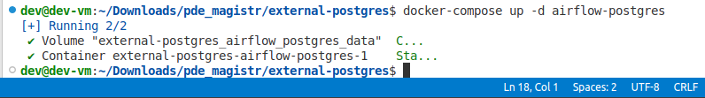
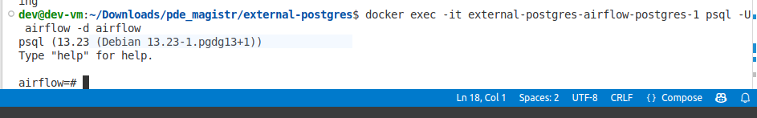
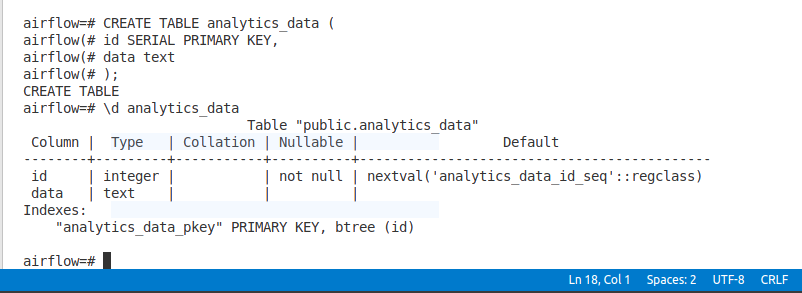

Лабораторная работа 1. 1. Установка и настройка Docker. Работа с контейнерами в Docker

Docker
Выполнил: студент группы АДЭУ-221 Дулис Кирилл Станиславович

Вариант №7

Образ: postgres

Задание: Реляционная БД. Запустить контейнер, настроить переменную POSTGRES_PASSWORD. Подключиться через psql и создать таблицу analytics_data с парой полей.

Ход выполнения работы:

1. Установка VirtualBox
2. Развертывание виртуальной машины из образа ETL+devops_26.ova
3. [Проверка установки Docker](https://github.com/dyx4liss/analytics-docker-labs/blob/main/lab1/docker-start.png)
4. [Команды Docker CLI:](https://github.com/dyx4liss/analytics-docker-labs/blob/main/lab1/docker-images.png)
5. [Docker ps -a](https://github.com/dyx4liss/analytics-docker-labs/blob/main/lab1/docker-ps-a.jpg)

Индивидуальное задание, вариант 7. 
1. Запуск контейнера
   
2. Подключение к postgreSQL 
3. Cоздание таблицы с парой полей 

Выводы:

Изучены основные команды работы с докер образами и контейнерами, в 
