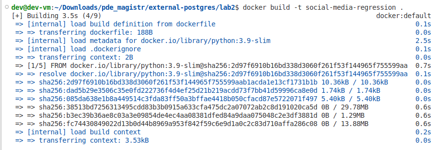
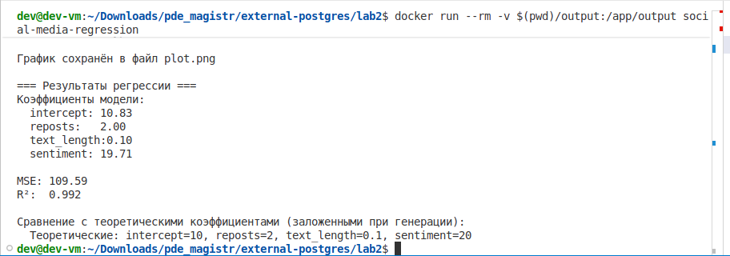
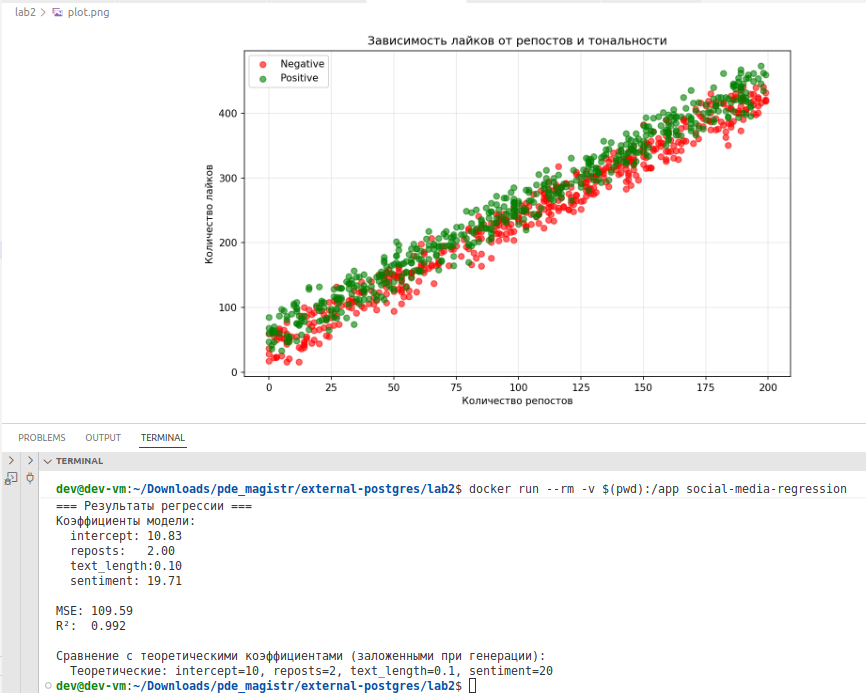

## Лабораторная работа 02.1 Создание Dockerfile и сборка образа

**ФИО:** Дулис Кирилл  
**Группа:** АДЭУ-221  
**Вариант:** 7  
**Тема данных:** Social Media  
**Техническое задание:** Python + Scikit-learn – скрипт генерирует данные для регрессии (X и y), обучает модель LinearRegression и выводит коэффициенты (влияние факторов).

---

## 1. Описание задачи

Цель работы — Разработать скрипт, который генерирурет данные cоц. сетей для регрессии, обучает модель LinearRegression, строит график и локально его сохраняет, выводит влияние факторов

---

## 2. Структура проекта

## Dockerfile

```FROM python:3.9-slim
WORKDIR /app
COPY requirements.txt .
RUN pip install --no-cache-dir -r requirements.txt
COPY main.py .
CMD ["python", "main.py"] 
```

## Генерация данных

```np.random.seed(42)
n_samples = 1000

reposts = np.random.randint(0, 200, n_samples)
text_length = np.random.randint(10, 500, n_samples)
sentiment = np.random.choice([0, 1], n_samples, p=[0.5, 0.5])

noise = np.random.normal(0, 10, n_samples)
likes = 10 + 2 * reposts + 0.1 * text_length + 20 * sentiment + noise
likes = np.maximum(0, np.round(likes)).astype(int)

df = pd.DataFrame({
    'post_id': range(1, n_samples + 1),
    'likes': likes,
    'reposts': reposts,
    'text_length': text_length,
    'sentiment': sentiment
})
```

## Расчет метрик

```print("=== Аналитическая часть ===")
print("Основные статистики:")
print(df.describe())

print("\nКорреляция признаков с целевой переменной (лайки):")
corr = df[['likes', 'reposts', 'text_length', 'sentiment']].corr()['likes'].sort_values(ascending=False)
print(corr)
```

## requirements.txt
```numpy>=1.21.0
pandas>=1.3.0
scikit-learn>=1.0.0
matplotlib>=3.4.0
```
## Запуск Docker


## Запуск контейнера и выгрузка графика в файл plot.png


## Файл plot.png, соотношение лайков и репостов, график


## Выводы:
В ходе выполнения лабораторной работы был разработан скрипт для генерации данных и анализа влияния факторов на количество лайков, создан докер-образ, продемонстрирована работа контейнера с выводом аналитики и построением графиков, а так же, коэффициенты модели оказались близки к теоретическим, что подтверждает корректность генерации данных.


