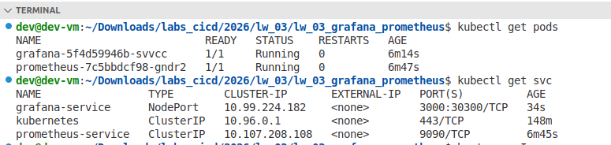
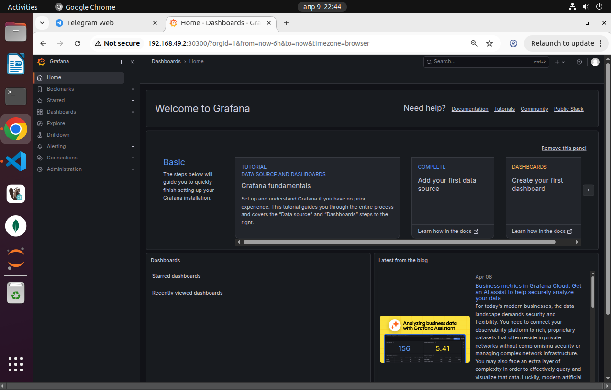

# Отчёт по лабораторной работе №3

## Развертывание приложения в Kubernetes

**Выполнил:** Дулис Кирилл, АДЭУ-221  
**Вариант №7:** Grafana (основной сервис) + Prometheus (вспомогательный сервис)  
**Задача:** Развернуть систему мониторинга. Grafana должна быть доступна через браузер (login: admin/admin).

---

## 1. Цель работы

Освоить базовые принципы развертывания приложений в Kubernetes:
- создание `Deployment` и `Service` для компонентов;
- настройка взаимодействия между сервисами через DNS имена;
- организация доступа к веб-интерфейсу из браузера;
- применение `ConfigMap` для конфигурации и `NodePort` для публикации сервиса.

---

## 2. Ход выполнения

### 2.1 Создание манифестов

<details>
  <summary>prometheus-configmap.yaml</summary>

  ```
apiVersion: v1
kind: ConfigMap
metadata:
  name: prometheus-config
data:
  prometheus.yml: |
    global:
      scrape_interval: 15s
    scrape_configs:
      - job_name: 'prometheus'
        static_configs:
          - targets: ['localhost:9090']
```
  
</details>

<details>
  <summary>prometheus-deployment.yaml</summary>

  ```
apiVersion: apps/v1
kind: Deployment
metadata:
  name: prometheus
  labels:
    app: prometheus
spec:
  replicas: 1
  selector:
    matchLabels:
      app: prometheus
  template:
    metadata:
      labels:
        app: prometheus
    spec:
      containers:
      - name: prometheus
        image: prom/prometheus:latest
        ports:
        - containerPort: 9090
        args:
          - '--config.file=/etc/prometheus/prometheus.yml'
          - '--storage.tsdb.path=/prometheus'
        volumeMounts:
        - name: config
          mountPath: /etc/prometheus
        - name: storage
          mountPath: /prometheus
      volumes:
      - name: config
        configMap:
          name: prometheus-config
      - name: storage
        emptyDir: {}
```
</details>

<details>
<summary>prometheus-service.yaml</summary>
  
```
apiVersion: v1
kind: Service
metadata:
  name: prometheus-service
spec:
  selector:
    app: prometheus
  ports:
    - protocol: TCP
      port: 9090
      targetPort: 9090
```
</details>

<details>
<summary>grafana-datasources-configmap.yaml</summary>

  ```
apiVersion: v1
kind: ConfigMap
metadata:
  name: grafana-datasources
data:
  prometheus.yaml: |
    apiVersion: 1
    datasources:
      - name: Prometheus
        type: prometheus
        access: proxy
        url: http://prometheus-service:9090
        isDefault: true
```
</details>

<details>
<summary>grafana-deployment.yaml</summary>

  ```
apiVersion: apps/v1
kind: Deployment
metadata:
  name: grafana
  labels:
    app: grafana
spec:
  replicas: 1
  selector:
    matchLabels:
      app: grafana
  template:
    metadata:
      labels:
        app: grafana
    spec:
      containers:
      - name: grafana
        image: grafana/grafana:latest
        ports:
        - containerPort: 3000
        env:
        - name: GF_SECURITY_ADMIN_USER
          value: "admin"
        - name: GF_SECURITY_ADMIN_PASSWORD
          value: "admin"
        volumeMounts:
        - name: datasources
          mountPath: /etc/grafana/provisioning/datasources
      volumes:
      - name: datasources
        configMap:
          name: grafana-datasources
```
</details>

<details>
<summary>grafana-service.yaml</summary>

  ```
apiVersion: v1
kind: Service
metadata:
  name: grafana-service
spec:
  type: NodePort
  selector:
    app: grafana
  ports:
    - protocol: TCP
      port: 3000
      targetPort: 3000
      nodePort: 30300
```
</details>

### Сетевые интерфейсы:
prometheus-service (ClusterIP, порт 9090) — доступен только внутри кластера для связи Grafana с Prometheus.
grafana-service (NodePort, порт 30300 на узле) — открывает доступ к Grafana из браузера.

### 2.2 Применение манифестов
```
kubectl apply -f prometheus-configmap.yaml
kubectl apply -f prometheus-deployment.yaml
kubectl apply -f prometheus-service.yaml
kubectl apply -f grafana-datasources-configmap.yaml
kubectl apply -f grafana-deployment.yaml
kubectl apply -f grafana-service.yaml
```
Ошибка при первом применении: error: no objects passed to apply – в файле grafana-service.yaml отсутствовали apiVersion, kind, metadata. После исправления всё применилось.

### 2.3 Проверка взаимодействия


---
## Итоги:
Интерфейс Grafana (192.168.49.2:30300)




