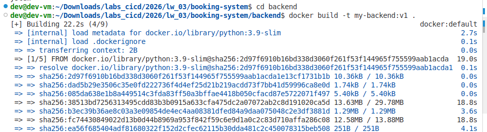
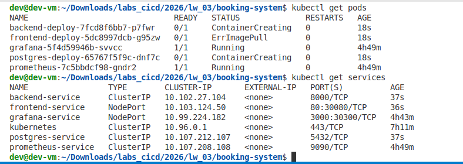
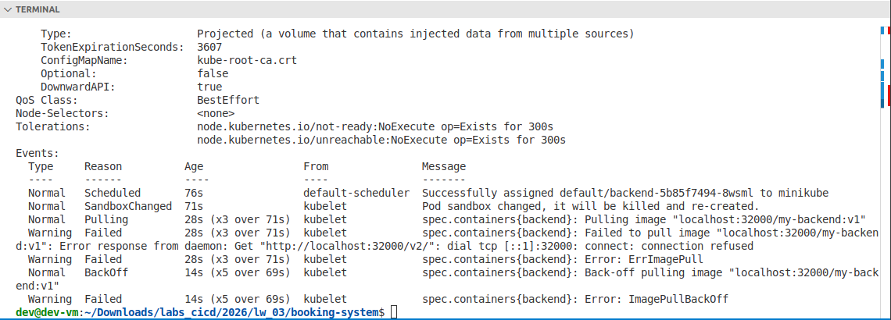

Лабораторная работа 4.1 — Создание и развертывание полнофункционального приложения

## Вариант 7: Booking System/Бронирование переговорных комнат/Комната, дата, время начала, время 
конца, кто забронировал.

Выполнил: студент группы АДЭУ-221, Дулис Кирилл 
Дата: 09.04.2026

---

## Цель
Применить полученные знания по созданию и развертыванию трехзвенного приложения (Frontend + Backend + Database) в кластере Kubernetes. Научиться организовывать взаимодействие между микросервисами.

## Структура проекта
```
booking-system/
├── backend/
│   ├── Dockerfile
│   ├── requirements.txt
│   └── main.py
├── frontend/
│   ├── Dockerfile
│   ├── requirements.txt
│   └── app.py
└── k8s/
    └── fullstack.yaml
```

## booking-system/backend

requirements.txt
```
fastapi
uvicorn
psycopg2-binary
sqlalchemy
pydantic
```
<details>
<summary>main.py</summary>

  ```
from fastapi import FastAPI, HTTPException
from pydantic import BaseModel
from sqlalchemy import create_engine, Column, Integer, String, Date, Time
from sqlalchemy.ext.declarative import declarative_base
from sqlalchemy.orm import sessionmaker
from sqlalchemy.sql import and_
import os
import time
from datetime import date, time

# Ожидание готовности БД (для надёжности в K8s)
time.sleep(5)

# Параметры подключения к БД из переменных окружения
DB_USER = os.getenv("DB_USER", "user")
DB_PASSWORD = os.getenv("DB_PASSWORD", "password")
DB_HOST = os.getenv("DB_HOST", "postgres-service")
DB_NAME = os.getenv("DB_NAME", "booking_db")

DATABASE_URL = f"postgresql://{DB_USER}:{DB_PASSWORD}@{DB_HOST}/{DB_NAME}"

engine = create_engine(DATABASE_URL)
SessionLocal = sessionmaker(autocommit=False, autoflush=False, bind=engine)
Base = declarative_base()

# Модель таблицы бронирований
class Booking(Base):
    __tablename__ = "bookings"
    id = Column(Integer, primary_key=True, index=True)
    room = Column(String, index=True)
    date = Column(Date)
    start_time = Column(Time)
    end_time = Column(Time)
    booked_by = Column(String)

Base.metadata.create_all(bind=engine)

app = FastAPI()

# Pydantic модели для запросов/ответов
class BookingCreate(BaseModel):
    room: str
    date: date
    start_time: time
    end_time: time
    booked_by: str

class BookingResponse(BookingCreate):
    id: int

    class Config:
        orm_mode = True

# Проверка конфликта бронирования
def is_overlapping(db, room: str, date_val: date, start: time, end: time, exclude_id: int = None):
    query = db.query(Booking).filter(
        and_(
            Booking.room == room,
            Booking.date == date_val,
            # Пересечение интервалов: start1 < end2 AND start2 < end1
            Booking.start_time < end,
            Booking.end_time > start
        )
    )
    if exclude_id is not None:
        query = query.filter(Booking.id != exclude_id)
    return query.first() is not None

@app.get("/bookings", response_model=list[BookingResponse])
def get_bookings(room: str = None, date: date = None):
    db = SessionLocal()
    query = db.query(Booking)
    if room:
        query = query.filter(Booking.room == room)
    if date:
        query = query.filter(Booking.date == date)
    bookings = query.all()
    db.close()
    return bookings

@app.post("/bookings", response_model=BookingResponse)
def add_booking(booking: BookingCreate):
    db = SessionLocal()
    # Проверка конфликта
    if is_overlapping(db, booking.room, booking.date, booking.start_time, booking.end_time):
        db.close()
        raise HTTPException(status_code=400, detail="Room is already booked for this time slot")
    new_booking = Booking(**booking.dict())
    db.add(new_booking)
    db.commit()
    db.refresh(new_booking)
    db.close()
    return new_booking

@app.delete("/bookings/{booking_id}")
def delete_booking(booking_id: int):
    db = SessionLocal()
    booking = db.query(Booking).filter(Booking.id == booking_id).first()
    if not booking:
        db.close()
        raise HTTPException(status_code=404, detail="Booking not found")
    db.delete(booking)
    db.commit()
    db.close()
    return {"message": "Booking deleted"}  
```
</details>

dockerfile
```
FROM python:3.9-slim
WORKDIR /app
COPY requirements.txt .
RUN pip install --no-cache-dir -r requirements.txt
COPY . .
CMD ["uvicorn", "main:app", "--host", "0.0.0.0", "--port", "8000"]
```

## booking-system/frontend

requirements.txt
```
streamlit
requests
pandas
```

<details>
<summary>app.py</summary>
  
```
import streamlit as st
import requests
import pandas as pd
import os
from datetime import date, time, datetime

BACKEND_URL = os.getenv("BACKEND_URL", "http://backend-service:8000")

st.set_page_config(page_title="Booking System", layout="wide")
st.title("📅 Бронирование переговорных комнат")

# --- Боковая панель: фильтры ---
st.sidebar.header("Фильтры")
filter_room = st.sidebar.text_input("Комната")
filter_date = st.sidebar.date_input("Дата", value=None)
if st.sidebar.button("Сбросить фильтры"):
    filter_room = ""
    filter_date = None

# --- Форма добавления бронирования ---
st.header("➕ Новое бронирование")
with st.form("booking_form"):
    col1, col2, col3 = st.columns(3)
    with col1:
        room = st.selectbox("Комната", ["Переговорная 101", "Переговорная 102", "Конференц-зал", "Зал совещаний"])
    with col2:
        booking_date = st.date_input("Дата", value=date.today())
    with col3:
        booked_by = st.text_input("Кто бронирует")
    col4, col5 = st.columns(2)
    with col4:
        start_time = st.time_input("Время начала", value=time(9, 0))
    with col5:
        end_time = st.time_input("Время окончания", value=time(10, 0))

    submitted = st.form_submit_button("Забронировать")

    if submitted:
        if not booked_by:
            st.error("Введите имя бронирующего")
        elif start_time >= end_time:
            st.error("Время окончания должно быть позже времени начала")
        else:
            payload = {
                "room": room,
                "date": booking_date.isoformat(),
                "start_time": start_time.isoformat(),
                "end_time": end_time.isoformat(),
                "booked_by": booked_by
            }
            try:
                resp = requests.post(f"{BACKEND_URL}/bookings", json=payload)
                if resp.status_code == 200:
                    st.success("✅ Бронирование успешно создано!")
                else:
                    detail = resp.json().get("detail", "Ошибка сервера")
                    st.error(f"❌ Ошибка: {detail}")
            except Exception as e:
                st.error(f"❌ Нет связи с бэкендом: {e}")

# --- Отображение бронирований ---
st.header("📋 Список бронирований")

def load_bookings():
    params = {}
    if filter_room:
        params["room"] = filter_room
    if filter_date:
        params["date"] = filter_date.isoformat()
    try:
        resp = requests.get(f"{BACKEND_URL}/bookings", params=params)
        if resp.status_code == 200:
            return resp.json()
        else:
            st.error("Ошибка загрузки данных")
            return []
    except Exception as e:
        st.error(f"Нет соединения с бэкендом: {BACKEND_URL}")
        return []

if st.button("🔄 Обновить данные"):
    st.experimental_rerun()

bookings = load_bookings()
if bookings:
    df = pd.DataFrame(bookings)
    # Преобразуем колонки для читаемости
    df["date"] = pd.to_datetime(df["date"]).dt.date
    df["start_time"] = pd.to_datetime(df["start_time"], format="%H:%M:%S").dt.time
    df["end_time"] = pd.to_datetime(df["end_time"], format="%H:%M:%S").dt.time
    st.dataframe(df[["room", "date", "start_time", "end_time", "booked_by"]], use_container_width=True)
else:
    st.info("Нет бронирований, удовлетворяющих фильтрам.")
```
</details>

dockerfile
```
FROM python:3.9-slim
WORKDIR /app
COPY requirements.txt .
RUN pip install --no-cache-dir -r requirements.txt
COPY . .
EXPOSE 8501
CMD ["streamlit", "run", "app.py", "--server.port=8501", "--server.address=0.0.0.0"]
```
## booking-system/k8s
<details>
<summary>fullstack.yaml</summary>
  
```
---
# PostgreSQL Deployment
apiVersion: apps/v1
kind: Deployment
metadata:
  name: postgres-deploy
spec:
  replicas: 1
  selector:
    matchLabels:
      app: postgres
  template:
    metadata:
      labels:
        app: postgres
    spec:
      containers:
      - name: postgres
        image: postgres:13
        env:
        - name: POSTGRES_USER
          value: "user"
        - name: POSTGRES_PASSWORD
          value: "password"
        - name: POSTGRES_DB
          value: "booking_db"
        ports:
        - containerPort: 5432

---
# PostgreSQL Service
apiVersion: v1
kind: Service
metadata:
  name: postgres-service
spec:
  selector:
    app: postgres
  ports:
    - port: 5432
      targetPort: 5432

---
# Backend Deployment
apiVersion: apps/v1
kind: Deployment
metadata:
  name: backend-deploy
spec:
  replicas: 1
  selector:
    matchLabels:
      app: backend
  template:
    metadata:
      labels:
        app: backend
    spec:
      containers:
      - name: backend
        image: my-backend:v1          # замените на свой образ
        imagePullPolicy: IfNotPresent # или Never для локальных образов в MicroK8s
        env:
        - name: DB_HOST
          value: "postgres-service"
        - name: DB_USER
          value: "user"
        - name: DB_PASSWORD
          value: "password"
        - name: DB_NAME
          value: "booking_db"
        ports:
        - containerPort: 8000

---
# Backend Service
apiVersion: v1
kind: Service
metadata:
  name: backend-service
spec:
  selector:
    app: backend
  ports:
    - port: 8000
      targetPort: 8000

---
# Frontend Deployment
apiVersion: apps/v1
kind: Deployment
metadata:
  name: frontend-deploy
spec:
  replicas: 1
  selector:
    matchLabels:
      app: frontend
  template:
    metadata:
      labels:
        app: frontend
    spec:
      containers:
      - name: frontend
        image: my-frontend:v1
        imagePullPolicy: IfNotPresent
        env:
        - name: BACKEND_URL
          value: "http://backend-service:8000"
        ports:
        - containerPort: 8501

---
# Frontend Service (NodePort для внешнего доступа)
apiVersion: v1
kind: Service
metadata:
  name: frontend-service
spec:
  type: NodePort
  selector:
    app: frontend
  ports:
    - port: 80
      targetPort: 8501
      nodePort: 30080
```
</details>

## Сборка и развёртывание 
Сборка backend

(по аналогии так же делаем с frontend)

get pods 


ойойойой все сломалось(((

